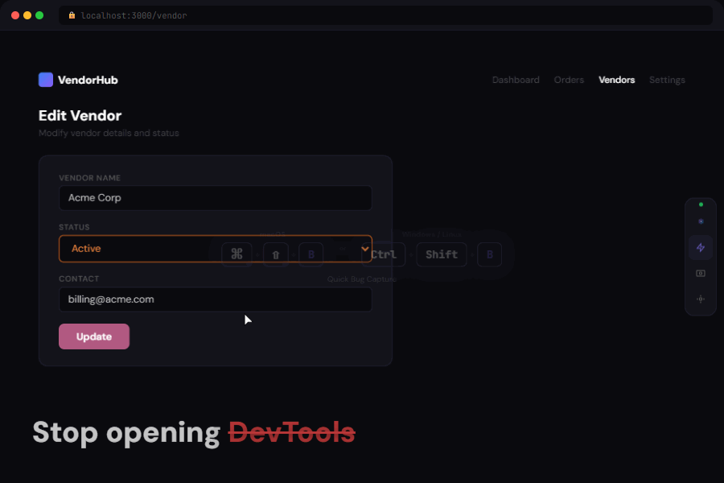

<h1 align="center">TraceBug</h1>

<p align="center">
  <strong>Stop wasting time debugging bugs.</strong><br>
  Capture &rarr; Know the cause &rarr; Create GitHub issue &mdash; <em>in 5 seconds</em>.
</p>

<p align="center">
  
</p>

<p align="center">
  <a href="https://chromewebstore.google.com/detail/tracebug-%E2%80%94-qa-bug-reporte/fdemmibikigigkfjngclmdheeajhdgaj"></a>
  <a href="https://www.npmjs.com/package/tracebug-sdk"></a>
  <a href="https://tracebug.netlify.app"></a>
</p>

<p align="center">
  <a href="https://www.npmjs.com/package/tracebug-sdk"></a>
  <a href="https://www.npmjs.com/package/tracebug-sdk"></a>
  <a href="https://github.com/prashantsinghmangat/tracebug-ai"></a>
  <a href="https://opensource.org/licenses/MIT"></a>
</p>

---

TraceBug is a browser-only debugging assistant that captures a bug, tells you the likely cause, and creates a GitHub issue in one click.

Every report now opens with:

```
🔍 Possible Cause (high confidence): API POST /orders failed with 500 after clicking 'Place Order'
> TL;DR: TypeError thrown on /checkout when clicking 'Place Order' button
```

No servers. No databases. No API keys. Data stays in your browser.

**Works with any frontend framework**: React, Angular, Vue, Next.js, Nuxt, Vite, Svelte, SvelteKit, Remix, Astro, or plain HTML.

## ⚡ Get Started in 30 Seconds

```bash
npx tracebug init
```

That's it. The CLI detects your framework and prints the exact 2-line snippet. Paste it into your app, run `npm run dev`, and you'll see the TraceBug toolbar on the right edge.

**Report a bug in 2 clicks:**
1. Press **`Ctrl+Shift+B`** (or click the ⚡ button on the toolbar)
2. Review the auto-filled report, click **"Copy as GitHub Issue"**
3. Paste into your repo. Done.

## What TraceBug Does

```
Tester uses the app normally
  ↓
SDK silently captures: clicks, inputs, navigation, API calls, errors, environment
  ↓
Tester finds a bug → clicks 📸 Screenshot → adds a note or 🎤 voice description
  ↓
Clicks "GitHub Issue" or "Jira Ticket"
  ↓
Complete bug report copied to clipboard:
  - Auto-generated title
  - Steps to reproduce
  - Screenshots with annotations
  - Voice bug description
  - Console errors + stack traces
  - Failed network requests
  - Environment (browser, OS, viewport)
  - Full session timeline
  ↓
Paste into GitHub/Jira → Developer has everything. No back-and-forth.
```

## Two Ways to Use TraceBug

### Option 1: npm Package (For Developers)

Install the SDK in your project — best for teams who want TraceBug always active on dev/staging.

```bash
npm install tracebug-sdk
```

```typescript
import TraceBug from "tracebug-sdk";
TraceBug.init({ projectId: "my-app" });
```

### Option 2: Chrome Extension (For Non-Developers)

Install the browser extension — no code needed. QA testers, PMs, and clients can use it on **any website**.

**[Install from Chrome Web Store](https://chromewebstore.google.com/detail/fdemmibikigigkfjngclmdheeajhdgaj)** — one click, works immediately.

| Browser | Supported |
|---------|-----------|
| Chrome | Yes — install from Chrome Web Store |
| Edge | Yes — Chrome Web Store extensions work natively |
| Brave | Yes — Chrome Web Store extensions work natively |
| Opera | Yes — install "Install Chrome Extensions" add-on first |
| Firefox | Not yet — use the npm SDK instead |

## Features

### 🧠 Debugging Assistant (v1.3)

Every report opens with four derived signals that turn "what happened" into "why it likely happened":

| Signal | What it looks like |
|---|---|
| **🔍 Root Cause Hint** | `"API POST /orders failed with 500 after clicking 'Place Order'"` with confidence tier (high/medium/low) |
| **TL;DR** | One-sentence summary combining network + error + click + page signals |
| **User clicked** | Tag, text, selector, id, aria-label, testId for the last click before the bug |
| **Recent Actions** | Last ~10 user actions as plain-English steps (`"Clicked 'Edit' button"`, `"Navigated to /checkout"`) |

Plus:

- **Network response snippets** — first 200 chars of every failed `fetch`/`XHR` response body, captured asynchronously (never blocks the request)
- **In-memory failure buffer** — last 10 failed requests accessible via `TraceBug.getNetworkFailures()`
- **Deterministic** — pure functions, no AI APIs, O(1) on already-computed report fields

All four signals ship inline in GitHub issues, Jira tickets, PDF reports, and the Quick Bug modal. See [docs/bug-reporting.md](docs/bug-reporting.md) for full output examples.

### Auto-Captured (Zero Effort)

| What | Details |
|------|---------|
| **Clicks** | Element tag, text, id, className, aria-label, role, data-testid, href, button type |
| **Inputs** | Field name, type, value (sensitive fields auto-redacted), placeholder |
| **Dropdowns** | Selected option text + value, all available options |
| **Form Submits** | Form id, action, method, all field values (passwords redacted) |
| **Navigation** | Route from → to (supports pushState, replaceState, popstate) |
| **API Requests** | URL, method, status code, response time (both `fetch` and `XMLHttpRequest`) |
| **Errors** | Message, stack trace, source file, line, column |
| **Console Errors** | `console.error()` calls |
| **Unhandled Rejections** | Promise rejection reason + stack |
| **Environment** | Browser, OS, viewport, device type, connection, language, timezone |

### UI Annotation Tools

| Tool | What it does |
|------|-------------|
| **Annotate Mode** | Click any element to attach feedback (intent, severity, comment). Shift+click for multi-select. `Ctrl+Shift+A` |
| **Draw Mode** | Drag rectangles or ellipses on the live page to mark layout/spacing issues. `Ctrl+Shift+D` |
| **Clickable Badges** | Numbered badges on annotated elements — click any badge to see intent, severity, and comment in a popover |
| **Annotation List** | View, export (Markdown/JSON), and manage all annotations in the panel — includes screenshots section |
| **Save with Annotations** | Screenshot the page with annotation badges visible, auto-downloads as PNG |

### QA Tools (One Click)

| Tool | What it does |
|------|-------------|
| **Screenshot** | Captures page screenshot with auto-generated name (e.g., `01_click_add_vendor.png`) |
| **Add Note** | Tester adds Expected/Actual/Severity — becomes part of the bug report |
| **GitHub Issue** | Generates complete GitHub issue markdown — copies to clipboard |
| **Jira Ticket** | Generates Jira-compatible ticket with priority, labels, description |
| **Voice Note** | Speak to describe the bug — speech-to-text, auto-included in reports |
| **PDF Report** | Opens printable bug report — save as PDF from browser |

### Auto-Generated

| Output | Details |
|--------|---------|
| **Bug Title** | Smart title from session context (e.g., "Vendor Update Fails — TypeError") |
| **Repro Steps** | Numbered steps generated from event timeline |
| **Session Timeline** | Debug timeline with elapsed timestamps for every event |
| **Environment Snapshot** | Browser version, OS, viewport, device type, connection |

### Smart Filtering

- **SDK self-filtering**: TraceBug never records its own UI interactions (clicks on the dashboard, annotation canvas, buttons)
- **Framework noise removal**: Internal dev-server requests (webpack HMR, Vite ping, Next.js stack frames) are automatically excluded from timeline and reports
- **Duplicate error dedup**: Consecutive identical errors are collapsed

### User Identification & Bug Workflow

```typescript
// Identify who's using the app (persisted in localStorage)
TraceBug.setUser({ id: "user_123", email: "dev@co.com", name: "Jane" });

// Flag current session as a bug (adds red BUG badge)
TraceBug.markAsBug();

// Get a 2-sentence Slack-friendly summary
const summary = TraceBug.getCompactReport();
// "Bug on /vendor — TypeError: Cannot read 'status' after clicking Edit → selecting Inactive..."
```

### Plugin & Hook System

Extend TraceBug without forking — filter events, enrich reports, or trigger custom actions:

```typescript
TraceBug.use({
  name: "slack-webhook",
  onReport: (report) => { fetch("https://hooks.slack.com/...", { method: "POST", body: JSON.stringify(report) }); return report; },
});

TraceBug.on("error:captured", (error) => console.log("Bug found:", error.data.error.message));
```

### CI/CD Helpers

```typescript
// In Playwright/Cypress tests
expect(TraceBug.getErrorCount()).toBe(0);

// Upload full session as test artifact on failure
const json = TraceBug.exportSessionJSON();
```

## Installation

### From npm

```bash
npm install tracebug-sdk
```

### From GitHub

```bash
npm install github:prashantsinghmangat/tracebug-ai
```

### Chrome Extension (No Code Required)

See [Chrome Extension](#chrome-extension) section below.

## Configuration

```typescript
TraceBug.init({
  projectId: "my-app",        // Required: identifies your app
  maxEvents: 200,             // Max events per session (default 200)
  maxSessions: 50,            // Max sessions in localStorage (default 50)
  enableDashboard: true,      // Show the floating bug button (default true)
  enabled: "auto",            // Control when SDK is active (see below)
});
```

### `enabled` option

| Value | Behavior |
|-------|----------|
| `"auto"` | Enabled in dev/staging, disabled in production (default) |
| `"development"` | Only when `NODE_ENV` is `"development"` |
| `"staging"` | Dev + staging hosts (`staging`, `stg`, `uat`, `qa` in hostname) |
| `"all"` | Always enabled, including production |
| `"off"` | Completely disabled |
| `string[]` | Custom hostnames, e.g. `["localhost", "staging.myapp.com"]` |

## Programmatic API

### Core

```typescript
import TraceBug from "tracebug-sdk";

TraceBug.pauseRecording();
TraceBug.resumeRecording();
TraceBug.startRecording();   // alias for resumeRecording
TraceBug.stopRecording();    // alias for pauseRecording
TraceBug.isRecording();
TraceBug.getSessionId();
TraceBug.destroy();
```

### Screenshots

```typescript
// Capture full-viewport screenshot (auto-named from last event context)
const screenshot = await TraceBug.takeScreenshot();
// → { filename: "01_click_add_vendor.png", dataUrl: "data:image/png;...", ... }

// Snipping-tool style: user drags a region, press Esc to cancel
const region = await TraceBug.takeRegionScreenshot();
// → { filename: "02_click_..._region.png", ... } | null

const allScreenshots = TraceBug.getScreenshots();
```

### Voice Recording

```typescript
// Check if voice recording is supported in the browser
if (TraceBug.isVoiceSupported()) {
  // Start recording — speech-to-text via Web Speech API (free, no API keys)
  TraceBug.startVoiceRecording({
    onUpdate: (text, interim) => console.log("Transcript:", text),
    onStatus: (status, msg) => console.log("Status:", status),
  });

  // Stop recording — returns the transcript
  const transcript = TraceBug.stopVoiceRecording();
  // → { id, timestamp, text: "When I click update the page breaks", duration }

  // Get all voice transcripts
  TraceBug.getVoiceTranscripts();
}
```

Voice transcripts are automatically included in GitHub Issue, Jira Ticket, and PDF reports.

### Tester Notes

```typescript
TraceBug.addNote({
  text: "Button doesn't respond after selecting Inactive status",
  expected: "Vendor should update successfully",
  actual: "App throws TypeError and freezes",
  severity: "critical",  // "critical" | "major" | "minor" | "info"
});
```

### Reports

```typescript
// Generate complete bug report object
const report = TraceBug.generateReport();

// Get auto-generated bug title
const title = TraceBug.getBugTitle();
// → "Vendor Update Fails — TypeError"

// Get GitHub issue markdown (copies to clipboard in dashboard)
const markdown = TraceBug.getGitHubIssue();

// Get Jira ticket payload
const ticket = TraceBug.getJiraTicket();
// → { summary, description, environment, priority, labels }

// Download PDF report
TraceBug.downloadPdf();

// Get environment info
const env = TraceBug.getEnvironment();
// → { browser: "Chrome", browserVersion: "122", os: "Windows 10/11", ... }
```

### Data Access

```typescript
import { getAllSessions, clearAllSessions, deleteSession } from "tracebug-sdk";

const sessions = getAllSessions();
const bugs = sessions.filter(s => s.errorMessage);
clearAllSessions();
deleteSession("session-id");
```

### Standalone Utilities

```typescript
import {
  generateReproSteps,
  captureEnvironment,
  buildReport,
  generateGitHubIssue,
  generateJiraTicket,
  generateBugTitle,
  buildTimeline,
  formatTimelineText,
} from "tracebug-sdk";
```

### Element Annotation & Draw

```typescript
// Activate modes programmatically
TraceBug.activateAnnotateMode();   // Click elements to annotate
TraceBug.activateDrawMode();       // Draw shapes on the page

// Check state
TraceBug.isAnnotateModeActive();
TraceBug.isDrawModeActive();

// Export all annotations
const report = TraceBug.getAnnotationReport();
const md = TraceBug.exportAnnotationsMarkdown();
await TraceBug.copyAnnotationsToClipboard("markdown");

// Deactivate
TraceBug.deactivateAnnotateMode();
TraceBug.deactivateDrawMode();
TraceBug.clearAnnotations();
```

## Dashboard

The compact toolbar on the right edge of the screen provides:

- **Session panel** (logo button) — Full bug reporting with timeline, errors, export
- **Annotate mode** — Click elements to attach feedback
- **Draw mode** — Draw rectangles/ellipses for layout issues
- **Screenshot** — Capture with annotation editor
- **Annotation list** — View/export/delete all annotations
- **Settings** — Pause recording, view stats, clear data

### Session Panel Details

- Session list with error/healthy indicators and "Repro Ready" badges
- QA Toolbar: Screenshot, Add Note, Voice Note, GitHub Issue, Jira Ticket, PDF Report
- Session overview, problems detected, error details, performance insights
- Tester notes, screenshots gallery, environment info
- Color-coded event timeline with rich details
- Auto-generated reproduction steps with copy button
- Export: JSON, Text, HTML, PDF, GitHub Issue, Jira Ticket

## Keyboard Shortcuts

| Shortcut | Action |
|----------|--------|
| `Ctrl+Shift+A` | Toggle annotate mode |
| `Ctrl+Shift+D` | Toggle draw mode |
| `Ctrl+Shift+S` | Take screenshot |
| `Esc` | Exit current mode |

## Documentation

Full documentation is in the [`docs/`](docs/) folder:

- [Getting Started](docs/getting-started.md) — Install, setup, first use
- [API Reference](docs/api-reference.md) — Complete programmatic API
- [Configuration](docs/configuration.md) — All config options explained
- [Bug Reporting](docs/bug-reporting.md) — Screenshots, notes, voice, export
- [Annotate & Draw](docs/annotate-and-draw.md) — UI annotation features
- [Chrome Extension](docs/chrome-extension.md) — Extension install & usage
- [Architecture](docs/architecture.md) — How TraceBug works internally

## Chrome Extension

The TraceBug Chrome Extension lets **non-developers** use all TraceBug features without writing code.

### How to Install

**Recommended:** [Install from Chrome Web Store](https://chromewebstore.google.com/detail/fdemmibikigigkfjngclmdheeajhdgaj) — works in Chrome, Edge, Brave, and Opera.

**From source** (for developers):
1. `git clone` this repo, then `npm install && npm run build`
2. Open `chrome://extensions/` → Enable Developer mode → Load unpacked → select `tracebug-extension/`

### How to Use

1. Navigate to any website (staging, production, localhost, internal tools)
2. Click the TraceBug extension icon in the toolbar
3. Toggle **"Enable on this site"** — the page reloads with TraceBug active
4. The floating bug button appears on the page
5. Use all QA tools: screenshots, notes, GitHub/Jira issues, PDF reports
6. Quick actions also available directly from the extension popup

### Extension Features

- **Per-site toggle** — enable only on sites you're testing
- **Badge indicator** — shows "ON" in green when active on current tab
- **Quick actions** — Annotate, Draw, Screenshot, PDF Report, GitHub Issue, Jira Ticket from the popup
- **Active sites list** — manage all enabled sites from the popup
- **Compact toolbar on page** — same full-featured toolbar as the npm SDK
- **CSP-safe** — uses `chrome.scripting.executeScript` with `world: "MAIN"` to bypass Content Security Policy restrictions

### Browser Compatibility

| Browser | Supported |
|---------|-----------|
| Google Chrome | Yes |
| Microsoft Edge | Yes |
| Brave | Yes |
| Opera | Yes (install "Install Chrome Extensions" add-on first) |
| Firefox | Not yet — use the npm SDK |

### Chrome Web Store

TraceBug is published on the Chrome Web Store:

**[Install TraceBug Extension](https://chromewebstore.google.com/detail/fdemmibikigigkfjngclmdheeajhdgaj)**

## Build from Source

```bash
# Clone the repo
git clone https://github.com/prashantsinghmangat/tracebug-ai.git
cd tracebug-ai

# Install dependencies
npm install

# Build SDK (produces CJS + ESM + IIFE for extension)
npm run build

# Output:
#   dist/index.js              — ESM (npm package)
#   dist/index.cjs             — CJS (npm package)
#   dist/index.d.ts            — TypeScript declarations
#   tracebug-extension/tracebug-sdk.js — IIFE (Chrome Extension)
```

### Run Example App

```bash
cd example-app
npm install
npm run dev
# Open http://localhost:3000
```

### Test the Example Bug

1. Go to `/vendor`
2. Click "Edit"
3. Change Status to "Inactive"
4. Click "Update" — triggers TypeError
5. Click the bug button to see the report with reproduction steps

## Privacy

- Sensitive fields auto-redacted (`password`, `secret`, `token`, `ssn`, `credit`)
- All data stays in `localStorage` — nothing leaves the browser
- SDK never captures its own UI interactions
- No external servers, no tracking, no analytics

## Framework Compatibility

| Format | File | Works with |
|--------|------|------------|
| ESM (`import`) | `dist/index.js` | Vite, Next.js, Nuxt, SvelteKit, modern webpack |
| CJS (`require`) | `dist/index.cjs` | Angular CLI, older webpack, Node.js |
| IIFE (global) | `tracebug-extension/tracebug-sdk.js` | Chrome Extension, plain `<script>` tag |
| TypeScript | `dist/index.d.ts` | Full type support in both ESM and CJS |

## Uninstall

### npm Package

```bash
npm uninstall tracebug-sdk
```

Then remove the `TraceBug.init()` call from your app's entry file.

---

## ⭐ Star this repo if it saves you time

If TraceBug helped you ship faster, a star is the best way to say thanks — it helps other developers find it too.

<p align="center">
  <a href="https://github.com/prashantsinghmangat/tracebug-ai/stargazers">
    
  </a>
</p>

**Spread the word:**
- [Share on Twitter/X](https://twitter.com/intent/tweet?text=Stop%20wasting%20time%20debugging%20bugs.%20Capture%20%E2%86%92%20know%20the%20cause%20%E2%86%92%20create%20GitHub%20issue%20in%205%20seconds.&url=https%3A%2F%2Ftracebug.netlify.app)
- [Share on LinkedIn](https://www.linkedin.com/sharing/share-offsite/?url=https%3A%2F%2Ftracebug.netlify.app)
- [Share on Hacker News](https://news.ycombinator.com/submitlink?u=https%3A%2F%2Ftracebug.netlify.app&t=TraceBug%20%E2%80%94%20capture%20a%20bug%20and%20know%20the%20root%20cause%20in%205%20seconds)

**Found a bug or have a feature idea?** [Open an issue](https://github.com/prashantsinghmangat/tracebug-ai/issues/new) — TraceBug was built because bug reports sucked. We're here to make them suck less.

---

<p align="center">
  Built with ❤ by <a href="https://github.com/prashantsinghmangat">Prashant Singh Mangat</a><br>
  <sub>MIT Licensed · No tracking · No backend · Your data stays in your browser</sub>
</p>

### Chrome Extension

Go to `chrome://extensions/` → click **Remove** on TraceBug.

## License

MIT

## Author

**Prashant Singh Mangat**
- GitHub: [prashantsinghmangat](https://github.com/prashantsinghmangat)
- npm: [tracebug-sdk](https://www.npmjs.com/package/tracebug-sdk)
