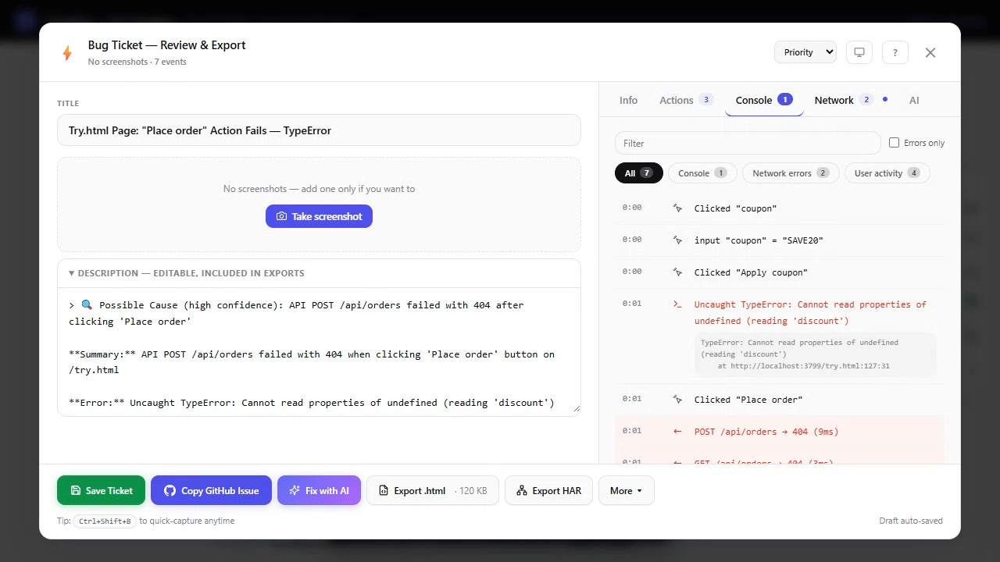

<h1 align="center">TraceBug</h1>

<p align="center">
  <strong>Bug reports your dev can actually open.</strong><br>
  Local-first. One <code>.html</code> file with full replay, console errors,
  network requests, and screenshots. Opens offline.
</p>

<p align="center">
  <a href="https://tracebug.dev/#demo"></a>
  <br>
  <a href="https://tracebug.dev/#demo"><b>▶ Watch the 15-second demo</b></a> · <a href="https://tracebug.dev/proof"><b>watch Claude debug a real bug</b></a> · <a href="https://tracebug.dev/try.html">try it live in the sandbox</a>
</p>

<p align="center">
  <a href="https://chromewebstore.google.com/detail/fdemmibikigigkfjngclmdheeajhdgaj"></a>
  <a href="https://www.npmjs.com/package/tracebug-sdk"></a>
  <a href="https://tracebug.dev"></a>
</p>

<p align="center">
  <a href="https://www.npmjs.com/package/tracebug-sdk"></a>
  <a href="https://www.npmjs.com/package/tracebug-sdk"></a>
  <a href="https://github.com/prashantsinghmangat/tracebug-ai"></a>
  <a href="https://opensource.org/licenses/MIT"></a>
</p>

---

TraceBug is a local-first debugging assistant. Capture a bug → produce a single self-contained `.html` file → email/Slack it to a dev → they open it offline and see exactly what happened.

Every report opens with:

```
🔍 Possible Cause (high confidence): API POST /orders failed with 500 after clicking 'Place Order'
> TL;DR: TypeError thrown on /checkout when clicking 'Place Order' button
```

No accounts. No SaaS lock-in. Data stays in your browser by default.

**Optional cloud sharing** (built, UI-gated off by default): if you'd rather share a URL than a file, sign in once and get a share link with the same content. The code ships behind a feature flag (`PHASE2-CLOUD`); the Share button stays disabled until the portal is switched on. Local `.html` export is the supported sharing path today.

**Works with any frontend framework**: React, Angular, Vue, Next.js, Nuxt, Vite, Svelte, SvelteKit, Remix, Astro, or plain HTML.

## ⚡ Get Started in 30 Seconds

> New here? **[Report your first bug in 2 minutes →](docs/quickstart.md)**

```bash
npx tracebug init
```

That's it. The CLI detects your framework and prints the exact 2-line snippet. Paste it into your app, run `npm run dev`, and you'll see the TraceBug toolbar on the right edge.

**Report a bug in 2 clicks:**
1. Press **`Ctrl+Shift+B`** (or click the ⚡ button on the toolbar)
2. Review the auto-filled report, click **"Copy GitHub Issue"**
3. Paste into your repo. Done.

## What TraceBug Does

```
Tester opens the page
  ↓
Arm a session (idle until you act):
  • ⚡ Quick Bug      — Ctrl+Shift+B opens the ticket-review modal
  • 📷 Screenshot / Region
  • 🔴 Record         — Sentry mode: rolling video buffer + HUD with timestamped
                        comments. File multiple bugs from one screen-share.
  • ⏺ Track session   — event-only capture (no video). Survives full-page
                        navigation, so clicking a link keeps recording.
  ↓
The SDK captures: clicks, inputs, navigation, API calls, console, errors, the DOM
stream (rrweb), environment, and a redacted Web-Storage snapshot
  ↓
Review the ticket, then export:
  • Export .html          — self-contained interactive DOM replay (KB, not MB)
  • Export for AI (.html) — tiny text-only report to paste into a chat
  • Download report (.md) · .zip (GitHub-attachable) · failing test (.spec.ts)
  • Export HAR · file a real GitHub/Linear/Slack/Jira issue
  ↓
Complete report includes:
  - Auto-generated title + smart summary + root-cause hint (high/medium/low confidence)
  - Steps to reproduce, full session timeline
  - Interactive DOM replay (or screen recording .webm), screenshots
  - Console errors + stack traces, failed network requests with response snippets
  - Environment (browser, OS, viewport, device)
  ↓
Send the .html → developer opens it offline and sees exactly what happened,
or an MCP-connected coding agent reads it and debugs from it.
```

> **Scan Page** (a11y via axe-core, broken images, mixed content, frustration
> signals, failed/slow APIs, JS errors) is available programmatically as
> `TraceBug.scanPage()`; it is no longer a toolbar button.

## Two Ways to Use TraceBug

### Option 1: npm Package (For Developers)

Install the SDK in your project — best for teams who want TraceBug always active on dev/staging.

```bash
npm install tracebug-sdk
```

```typescript
import TraceBug from "tracebug-sdk";
TraceBug.init({ projectId: "my-app" });
```

### Option 2: Chrome Extension (For Non-Developers)

Install the browser extension — no code needed. QA testers, PMs, and clients can use it on **any website**.

**[Install from Chrome Web Store](https://chromewebstore.google.com/detail/fdemmibikigigkfjngclmdheeajhdgaj)** — one click, works immediately.

| Browser | Supported |
|---------|-----------|
| Chrome | Yes — install from Chrome Web Store |
| Edge | Yes — Chrome Web Store extensions work natively |
| Brave | Yes — Chrome Web Store extensions work natively |
| Opera | Yes — install "Install Chrome Extensions" add-on first |
| Firefox | Not yet — use the npm SDK instead |

## Browser support

| Browser | npm SDK | Extension |
|---------|:---:|:---:|
| Chrome | ✅ | ✅ |
| Edge | ✅ | ✅ |
| Brave / Opera | ✅ | ✅ |
| Firefox | ✅ | ⏳ (port paused — SDK only) |
| Safari | ✅¹ | ❌ (SDK only) |

The **SDK** is framework- and browser-agnostic — it runs anywhere modern JS runs.
¹ The interactive DOM-replay export uses the browser-native `CompressionStream` /
`DecompressionStream` (Chrome 80+, Firefox 113+, Safari 16.4+); on older engines
the exporter ships the replay uncompressed and the viewer falls back to the
screenshot gallery. The **extension** is Chromium-only today (Firefox port paused;
no Safari build) — on those, use the npm SDK.

## Features

### 🧠 Debugging Assistant (v1.3)

Every report opens with four derived signals that turn "what happened" into "why it likely happened":

| Signal | What it looks like |
|---|---|
| **🔍 Root Cause Hint** | `"API POST /orders failed with 500 after clicking 'Place Order'"` with confidence tier (high/medium/low) |
| **TL;DR** | One-sentence summary combining network + error + click + page signals |
| **User clicked** | Tag, text, selector, id, aria-label, testId for the last click before the bug |
| **Recent Actions** | Last ~10 user actions as plain-English steps (`"Clicked 'Edit' button"`, `"Navigated to /checkout"`) |

Plus:

- **Network response snippets** — first 200 chars of every failed `fetch`/`XHR` response body, captured asynchronously (never blocks the request)
- **In-memory failure buffer** — last 10 failed requests accessible via `TraceBug.getNetworkFailures()`
- **Deterministic** — pure functions, no AI APIs, O(1) on already-computed report fields

All four signals ship inline in GitHub issues, Jira tickets, PDF reports, and the Quick Bug modal. See [docs/bug-reporting.md](docs/bug-reporting.md) for full output examples.

### 🤖 MCP Server — AI Agents Debug Your Reports (v1.5)

Your coding agent (Claude Code, Cursor, Windsurf, VS Code) reads TraceBug bug reports and fixes the bug — **fully local, nothing uploaded**:

```bash
claude mcp add tracebug -- npx -y tracebug mcp --dir ./bug-reports
```

The server reads the same self-contained `.html` files TraceBug exports. A tester hands a dev the report file, the dev drops it in the repo, and the agent gets nine tools: `list_bug_reports`, `get_bug_report`, `get_console_errors`, `get_network_activity`, `get_repro_steps`, `get_screenshot` (real image content), `get_playwright_test`, `resolve_stack`, and `get_fix_context`. `get_bug_report` returns a prioritized **investigation guide** computed from what the report contains, so the agent knows exactly which tools to call next. Console stacks + failed-request bodies + repro steps + frustration signals — everything an agent needs to go from bug report to fix.

The last three close the fix loop (v1.9): `get_playwright_test` returns the generated **failing Playwright spec** that replays the session and asserts the captured failure is gone — red until the bug is fixed, green after — so the agent can run it, patch, and re-run until green. `resolve_stack` maps the report's minified stack frames to original source files/lines using `.map` files found in the repo the server runs from. `get_fix_context` is a one-call fix starter: the failing request with response snippet, the user action that triggered it, the source-map-resolved top stack frames, and whether a failing test is available.

Kicking off is one paste: the extension shows a ready-made agent prompt after every **Export .html** (auto-copied), the exported file itself carries the same prompt in its **AI** tab, and in Claude Code you can just type `/tracebug:debug_bug_report`.

Other tools' MCP servers are cloud-hosted: your bug data must live on their servers first. TraceBug's runs on your machine over stdio and opens **zero network connections**. Try it instantly — this repo ships a demo report and a pre-configured [`.mcp.json`](.mcp.json). See [docs/mcp.md](docs/mcp.md).

### 🎭 Playwright Reporter — Bug Reports From Failed Tests (v1.6)

Every failed Playwright test becomes the same self-contained `.html` bug report — assertion error + code snippet, step timeline as repro steps, page console + network (via the optional fixture), failure screenshot, and a root-cause hint. Upload `bug-reports/` as a CI artifact, then debug it with your agent via the MCP server:

```ts
// playwright.config.ts — that's the whole setup
reporter: [["list"], ["tracebug-sdk/playwright", { outputDir: "bug-reports" }]],
```

Nobody else captures bugs from test runs as portable files — cloud tools can't attach their viewer to a CI artifact. See [docs/playwright.md](docs/playwright.md).

### 🧠 AI Debugger — BYO-Key LLM Analysis (v1.6)

Run real LLM root-cause analysis with **your own key** — Anthropic, OpenAI, or local Ollama. The call goes **directly from your browser to the provider**: TraceBug never sees the key, the prompt, or the response, and the prompt is scrubbed of secret shapes before it leaves the page. No metered credits, no vendor cloud in the path.

Combined with the local heuristic hint and the local MCP server, this is **AI debugging that never phones home** — the one position no cloud-hosted, metered competitor can copy. See [docs/ai-debugger.md](docs/ai-debugger.md).

### 🌐 HAR Export (v1.6)

One click exports the captured network activity as a standard **HAR 1.2** file that opens in DevTools, Charles, Fiddler, or Postman. No competitor ships this — Jam even markets "everything a HAR offers" without the export. Your network capture is a portable file you own, not a row in someone's cloud. See [docs/har-export.md](docs/har-export.md).

### 🧪 Generated Failing Playwright Test (v1.9)

Every export carries a runnable Playwright spec that **replays the captured session** (locators prefer `data-testid` → id → aria-label → role+name → captured CSS selector) and **asserts the captured failure is gone** — the failing endpoint must stop failing, the console errors must stop being thrown. Red while the bug exists, green after the fix. Get it three ways: **Download failing test (.spec.ts)** in the Quick Bug More menu, embedded in the `.html` export, or via the MCP `get_playwright_test` tool — so an agent can run it, patch, and re-run until green.

### 🔎 Inspect Mode — Style Evidence for Design-QA Bugs (v1.9)

"The button looks wrong" now ships with the receipts. A DevTools-style inspect mode (extension popup → **Inspect element**, or `TraceBug.activateInspectMode()`): hover paints the box-model highlight plus a computed-style summary tooltip; click attaches the element to the report with a curated style snapshot — typography, colors as hex, box model — plus a **WCAG text-contrast verdict** (ratio + AA pass/fail). Surfaced on annotation cards, in generated GitHub issues, in the export, and as structured data MCP agents get from `get_bug_report`.

### 🎬 Pre-Recording Options + Element-Level Blur (v1.9)

The extension popup's **⚙ Record options** panel picks the capture surface (current tab / desktop picker), an optional 3s/5s countdown, and **Blur before recording** — redact sensitive areas *before* the first frame is captured. Also public SDK API: `TraceBug.prepareRecording({ blurFirst, delaySec, surfaceMode, withMicrophone })`.

Blur itself is element-level, click-to-blur: hover highlights, click applies `filter: blur(12px)` **to the element itself**, click again unblurs. Because the blur is part of the element's own rendering, it physically cannot lag behind scrolling. Blurred elements also get `tb-mask`, so the DOM replay masks their text, not just the video pixels.

### 📦 Reports the Recipient Can Act On (v1.8)

- **Download .zip (attach to GitHub)** — the same offline replay wrapped in a `.zip`, because GitHub issues accept `.zip` attachments by drag-and-drop but reject bare `.html`.
- **Issue actions inside the exported report** — the viewer header has **Open GitHub issue** (prefilled URL when the exporter configured `githubRepo`) and **Copy issue markdown** (fully offline, pastes into any tracker). Both are precomputed at export time from the already-redacted report.

### Auto-Captured (Zero Effort)

| What | Details |
|------|---------|
| **Clicks** | Element tag, text, id, className, aria-label, role, data-testid, href, button type |
| **Inputs** | Field name, type, value (sensitive fields auto-redacted), placeholder |
| **Dropdowns** | Selected option text + value, all available options |
| **Form Submits** | Form id, action, method, all field values (passwords redacted) |
| **Navigation** | Route from → to (supports pushState, replaceState, popstate) |
| **API Requests** | URL, method, status code, response time (both `fetch` and `XMLHttpRequest`) |
| **Errors** | Message, stack trace, source file, line, column |
| **Console** | `console.error` + `warn` + `info` + `log` (each non-error level capped at 50/session); warn/info render in the repro timeline |
| **Unhandled Rejections** | Promise rejection reason + stack |
| **Environment** | Browser, OS, viewport, device type, connection, language, timezone |

### Sentry Mode — Rolling Video Buffer

Click **Record** once at the start of a QA session, file as many bug tickets as you want from the same screen-share. Inspired by NVIDIA Shadowplay / OBS replay buffer.

| Feature | What it does |
|---|---|
| **One-time picker** | Click Record → pick screen/window/tab in the OS dialog. The HUD appears; you do QA normally. |
| **📸 Capture button** | Snapshots the in-progress recording into a finished `.webm` and opens the ticket modal. Recording keeps running. |
| **Timestamped comments** | Type a note in the HUD → press Enter → it's saved with the current video timestamp. |
| **Auto-capture on error** | When a JS error fires while armed, the error toast offers "Capture with video" — one click captures the buffer. |
| **Smart Stop** | If you took at least one capture, Stop ends silently. Otherwise it opens the modal with the full recording. |

### Auto-Scanner

Click **Scan** to run six in-browser detectors in parallel and surface issues you might not have noticed:

| Detector | What it catches |
|---|---|
| **a11y** | WCAG 2.0/2.1 A+AA violations via [axe-core](https://github.com/dequelabs/axe-core) |
| **Broken images** | `` elements that failed to load |
| **Mixed content** | `http://` resources on HTTPS pages (CSP-blocked or downgraded) |
| **JS errors** | Deduped console errors + unhandled rejections |
| **Failed requests** | 4xx/5xx/network-error API calls with response body snippets |
| **Slow APIs** | Successful calls over 2s |

Each issue offers **Locate** (flash the offending element), **File ticket** (pre-fills the Quick Bug modal), and **Dismiss**.

### QA Tools (One Click)

| Tool | What it does |
|------|-------------|
| **Quick Bug Capture** | `Ctrl+Shift+B` opens the ticket-review modal with auto-filled title + description |
| **Screenshot** | Captures viewport with auto-generated name (e.g., `01_click_add_vendor.png`); added to the active ticket |
| **Region Screenshot** | Drag-to-select snipping-tool style; added to ticket |
| **Voice Note** | Speak to describe the bug — speech-to-text via Web Speech API |
| **GitHub Issue** | Generates complete GitHub markdown — copies to clipboard, screenshots + .webm auto-download |
| **Jira Ticket** | Generates Jira markup with priority + labels |

### Available Programmatically (cut from default UI in v1.0)

These features still ship in the bundle but no longer have toolbar buttons. Power users can call them directly:

```typescript
TraceBug.activateAnnotateMode();   // element annotate mode (Ctrl+Shift+A no longer wired)
TraceBug.activateDrawMode();       // live-page rectangles/ellipses
TraceBug.downloadPdf();            // PDF report
TraceBug.exportAnnotationsJSON();  // JSON / Markdown export
```

### Auto-Generated

| Output | Details |
|--------|---------|
| **Bug Title** | Smart title from session context (e.g., "Vendor Update Fails — TypeError") |
| **Repro Steps** | Numbered steps generated from event timeline |
| **Session Timeline** | Debug timeline with elapsed timestamps for every event |
| **Environment Snapshot** | Browser version, OS, viewport, device type, connection |

### Smart Filtering

- **SDK self-filtering**: TraceBug never records its own UI interactions (clicks on the dashboard, annotation canvas, buttons)
- **Framework noise removal**: Internal dev-server requests (webpack HMR, Vite ping, Next.js stack frames) are automatically excluded from timeline and reports
- **Duplicate error dedup**: Consecutive identical errors are collapsed

### User Identification & Bug Workflow

```typescript
// Identify who's using the app (persisted in localStorage)
TraceBug.setUser({ id: "user_123", email: "dev@co.com", name: "Jane" });

// Flag current session as a bug (adds red BUG badge)
TraceBug.markAsBug();

// Get a 2-sentence Slack-friendly summary
const summary = TraceBug.getCompactReport();
// "Bug on /vendor — TypeError: Cannot read 'status' after clicking Edit → selecting Inactive..."
```

### Plugin & Hook System

Extend TraceBug without forking — filter events, enrich reports, or trigger custom actions:

```typescript
TraceBug.use({
  name: "slack-webhook",
  onReport: (report) => { fetch("https://hooks.slack.com/...", { method: "POST", body: JSON.stringify(report) }); return report; },
});

TraceBug.on("error:captured", (error) => console.log("Bug found:", error.data.error.message));
```

### CI/CD Helpers

```typescript
// In Playwright/Cypress tests
expect(TraceBug.getErrorCount()).toBe(0);

// Upload full session as test artifact on failure
const json = TraceBug.exportSessionJSON();
```

## Installation

### From npm

```bash
npm install tracebug-sdk
```

### From GitHub

```bash
npm install github:prashantsinghmangat/tracebug-ai
```

### Chrome Extension (No Code Required)

See [Chrome Extension](#chrome-extension) section below.

## Configuration

```typescript
TraceBug.init({
  projectId: "my-app",        // Required: identifies your app
  maxEvents: 200,             // Max events per session (default 200)
  maxSessions: 50,            // Max sessions in localStorage (default 50)
  enableDashboard: true,      // Show the floating bug button (default true)
  enabled: "auto",            // Control when SDK is active (see below)
});
```

### `enabled` option

| Value | Behavior |
|-------|----------|
| `"auto"` | Enabled in dev/staging, disabled in production (default) |
| `"development"` | Only when `NODE_ENV` is `"development"` |
| `"staging"` | Dev + staging hosts (`staging`, `stg`, `uat`, `qa` in hostname) |
| `"all"` | Always enabled, including production |
| `"off"` | Completely disabled |
| `string[]` | Custom hostnames, e.g. `["localhost", "staging.myapp.com"]` |

## Programmatic API

### Core

```typescript
import TraceBug from "tracebug-sdk";

TraceBug.pauseRecording();
TraceBug.resumeRecording();
TraceBug.startRecording();   // alias for resumeRecording
TraceBug.stopRecording();    // alias for pauseRecording
TraceBug.isRecording();
TraceBug.getSessionId();
TraceBug.destroy();
```

### Screenshots

```typescript
// Capture full-viewport screenshot (auto-named from last event context)
const screenshot = await TraceBug.takeScreenshot();
// → { filename: "01_click_add_vendor.png", dataUrl: "data:image/png;...", ... }

// Snipping-tool style: user drags a region, press Esc to cancel
const region = await TraceBug.takeRegionScreenshot();
// → { filename: "02_click_..._region.png", ... } | null

const allScreenshots = TraceBug.getScreenshots();
```

### Voice Recording

```typescript
// Check if voice recording is supported in the browser
if (TraceBug.isVoiceSupported()) {
  // Start recording — speech-to-text via Web Speech API (free, no API keys)
  TraceBug.startVoiceRecording({
    onUpdate: (text, interim) => console.log("Transcript:", text),
    onStatus: (status, msg) => console.log("Status:", status),
  });

  // Stop recording — returns the transcript
  const transcript = TraceBug.stopVoiceRecording();
  // → { id, timestamp, text: "When I click update the page breaks", duration }

  // Get all voice transcripts
  TraceBug.getVoiceTranscripts();
}
```

Voice transcripts are automatically included in GitHub Issue, Jira Ticket, and PDF reports.

### Tester Notes

```typescript
TraceBug.addNote({
  text: "Button doesn't respond after selecting Inactive status",
  expected: "Vendor should update successfully",
  actual: "App throws TypeError and freezes",
  severity: "critical",  // "critical" | "major" | "minor" | "info"
});
```

### Reports

```typescript
// Generate complete bug report object
const report = TraceBug.generateReport();

// Get auto-generated bug title
const title = TraceBug.getBugTitle();
// → "Vendor Update Fails — TypeError"

// Get GitHub issue markdown (copies to clipboard in dashboard)
const markdown = TraceBug.getGitHubIssue();

// Get Jira ticket payload
const ticket = TraceBug.getJiraTicket();
// → { summary, description, environment, priority, labels }

// Download PDF report
TraceBug.downloadPdf();

// Get environment info
const env = TraceBug.getEnvironment();
// → { browser: "Chrome", browserVersion: "122", os: "Windows 10/11", ... }
```

### Data Access

```typescript
import { getAllSessions, clearAllSessions, deleteSession } from "tracebug-sdk";

const sessions = getAllSessions();
const bugs = sessions.filter(s => s.errorMessage);
clearAllSessions();
deleteSession("session-id");
```

### Standalone Utilities

```typescript
import {
  generateReproSteps,
  captureEnvironment,
  buildReport,
  generateGitHubIssue,
  generateJiraTicket,
  generateBugTitle,
  buildTimeline,
  formatTimelineText,
} from "tracebug-sdk";
```

### Element Annotation & Draw

```typescript
// Activate modes programmatically
TraceBug.activateAnnotateMode();   // Click elements to annotate
TraceBug.activateDrawMode();       // Draw shapes on the page

// Check state
TraceBug.isAnnotateModeActive();
TraceBug.isDrawModeActive();

// Export all annotations
const report = TraceBug.getAnnotationReport();
const md = TraceBug.exportAnnotationsMarkdown();
await TraceBug.copyAnnotationsToClipboard("markdown");

// Deactivate
TraceBug.deactivateAnnotateMode();
TraceBug.deactivateDrawMode();
TraceBug.clearAnnotations();
```

## Dashboard

The compact toolbar on the right edge of the screen provides:

- **⚡ Quick Bug** — open the ticket-review modal (`Ctrl+Shift+B`)
- **📷 Screenshot** — capture the page, with an annotation editor
- **▢ Region** — capture a selected region
- **🔴 Record** — screen recording (Sentry mode: rolling buffer + HUD)
- **⏺ Track session** — event-only capture, no video (survives navigation)
- **✓ View saved tickets** — the offline Saved Tickets list
- **✕** — turn TraceBug off on this page

> Annotate and Draw modes still ship in the bundle but were cut as standalone
> toolbar buttons in v1.0 — reach them programmatically or via the recording
> HUD's Pen button. See [docs/annotate-and-draw.md](docs/annotate-and-draw.md).

### Quick Bug modal

Review and edit the ticket, then export or file it:

- Auto-generated title, summary, root-cause hint, reproduction steps, timeline
- Interactive DOM replay (or the screen recording), screenshots gallery
- Tabs: Info · Console · Network · Actions · AI · Events
- Export: **Export .html** (replay) · **Export for AI (.html)** · **Download report (.md)** · **Download .zip** (GitHub-attachable) · **Download failing test (.spec.ts)** · **Export HAR**
- File directly: GitHub · Linear · Slack · Jira (real issues with a configured token)

## Keyboard Shortcuts

| Shortcut | Action |
|----------|--------|
| `Ctrl+Shift+B` | Open the Quick Bug ticket modal |
| `Ctrl+Shift+S` | Take a screenshot |
| `Esc` | Exit the current mode / close the modal |

> Note: `Ctrl+Shift+A` (annotate) and `Ctrl+Shift+D` (draw) are no longer bound by default. The underlying modes remain callable via the programmatic API (`TraceBug.activateAnnotateMode()` / `activateDrawMode()`); draw mode is also reachable from the ✎ button on the recording HUD.

## Documentation

Full documentation is in the [`docs/`](docs/) folder:

- [Getting Started](docs/getting-started.md) — Install, setup, first use
- [API Reference](docs/api-reference.md) — Complete programmatic API
- [Configuration](docs/configuration.md) — All config options explained
- [Bug Reporting](docs/bug-reporting.md) — Screenshots, notes, voice, export
- [MCP Server](docs/mcp.md) — Let AI agents (Claude Code, Cursor) debug your reports
- [Annotate & Draw](docs/annotate-and-draw.md) — UI annotation features
- [Chrome Extension](docs/chrome-extension.md) — Extension install & usage
- [Architecture](docs/architecture.md) — How TraceBug works internally

## Chrome Extension

The TraceBug Chrome Extension lets **non-developers** use all TraceBug features without writing code.

### How to Install

**Recommended:** [Install from Chrome Web Store](https://chromewebstore.google.com/detail/fdemmibikigigkfjngclmdheeajhdgaj) — works in Chrome, Edge, Brave, and Opera.

**From source** (for developers):
1. `git clone` this repo, then `npm install && npm run build`
2. Open `chrome://extensions/` → Enable Developer mode → Load unpacked → select `tracebug-extension/`

### How to Use

1. Navigate to any website (staging, production, localhost, internal tools)
2. Click the TraceBug extension icon in the toolbar
3. Toggle **"Enable on this site"** — the page reloads with TraceBug active
4. The floating bug button appears on the page
5. Use all QA tools: screenshots, notes, GitHub/Jira issues, PDF reports
6. Quick actions also available directly from the extension popup

### Extension Features

- **Per-site toggle** — enable only on sites you're testing
- **Badge indicator** — shows "ON" in green when active on current tab
- **Quick actions** — Annotate, Draw, Screenshot, PDF Report, GitHub Issue, Jira Ticket from the popup
- **Active sites list** — manage all enabled sites from the popup
- **Compact toolbar on page** — same full-featured toolbar as the npm SDK
- **CSP-safe** — uses `chrome.scripting.executeScript` with `world: "MAIN"` to bypass Content Security Policy restrictions

### Browser Compatibility

| Browser | Supported |
|---------|-----------|
| Google Chrome | Yes |
| Microsoft Edge | Yes |
| Brave | Yes |
| Opera | Yes (install "Install Chrome Extensions" add-on first) |
| Firefox | Not yet — use the npm SDK |

### Chrome Web Store

TraceBug is published on the Chrome Web Store:

**[Install TraceBug Extension](https://chromewebstore.google.com/detail/fdemmibikigigkfjngclmdheeajhdgaj)**

## Build from Source

```bash
# Clone the repo
git clone https://github.com/prashantsinghmangat/tracebug-ai.git
cd tracebug-ai

# Install dependencies
npm install

# Build SDK (produces CJS + ESM + IIFE for extension)
npm run build

# Output:
#   dist/index.js              — ESM (npm package)
#   dist/index.cjs             — CJS (npm package)
#   dist/index.d.ts            — TypeScript declarations
#   tracebug-extension/tracebug-sdk.js — IIFE (Chrome Extension)
```

### Run Example App

```bash
cd example-app
npm install
npm run dev
# Open http://localhost:3000
```

### Test the Example Bug

1. Go to `/vendor`
2. Click "Edit"
3. Change Status to "Inactive"
4. Click "Update" — triggers TypeError
5. Click the bug button to see the report with reproduction steps

## Privacy

- Sensitive fields auto-redacted (`password`, `secret`, `token`, `ssn`, `credit`)
- ~20 token-shape patterns masked at capture (JWT, `Bearer` headers, cloud provider keys) — a logged secret never enters the report object
- The export flow and the exported report show exactly what was masked: `🛡 N sensitive values auto-masked`
- App-specific PII covered via `redact: { fields, patterns }` in config — also settable in the extension popup's 🛡 Redaction rules section
- All data stays in `localStorage` — nothing leaves the browser
- SDK never captures its own UI interactions
- No external servers, no tracking, no analytics

## Framework Compatibility

| Format | File | Works with |
|--------|------|------------|
| ESM (`import`) | `dist/index.js` | Vite, Next.js, Nuxt, SvelteKit, modern webpack |
| CJS (`require`) | `dist/index.cjs` | Angular CLI, older webpack, Node.js |
| IIFE (global) | `tracebug-extension/tracebug-sdk.js` | Chrome Extension, plain `<script>` tag |
| TypeScript | `dist/index.d.ts` | Full type support in both ESM and CJS |

## Uninstall

### npm Package

```bash
npm uninstall tracebug-sdk
```

Then remove the `TraceBug.init()` call from your app's entry file.

---

## ⭐ Star this repo if it saves you time

If TraceBug helped you ship faster, a star is the best way to say thanks — it helps other developers find it too.

<p align="center">
  <a href="https://github.com/prashantsinghmangat/tracebug-ai/stargazers">
    
  </a>
</p>

**Spread the word:**
- [Share on Twitter/X](https://twitter.com/intent/tweet?text=Stop%20wasting%20time%20debugging%20bugs.%20Capture%20%E2%86%92%20know%20the%20cause%20%E2%86%92%20create%20GitHub%20issue%20in%205%20seconds.&url=https%3A%2F%2Ftracebug.dev)
- [Share on LinkedIn](https://www.linkedin.com/sharing/share-offsite/?url=https%3A%2F%2Ftracebug.dev)
- [Share on Hacker News](https://news.ycombinator.com/submitlink?u=https%3A%2F%2Ftracebug.dev&t=TraceBug%20%E2%80%94%20capture%20a%20bug%20and%20know%20the%20root%20cause%20in%205%20seconds)

**Found a bug or have a feature idea?** [Open an issue](https://github.com/prashantsinghmangat/tracebug-ai/issues/new) — TraceBug was built because bug reports sucked. We're here to make them suck less.

---

<p align="center">
  Built with ❤ by <a href="https://github.com/prashantsinghmangat">Prashant Singh Mangat</a><br>
  <sub>MIT Licensed · No tracking · No backend · Your data stays in your browser</sub>
</p>

### Chrome Extension

Go to `chrome://extensions/` → click **Remove** on TraceBug.

## License

MIT

## Author

**Prashant Singh Mangat**
- GitHub: [prashantsinghmangat](https://github.com/prashantsinghmangat)
- npm: [tracebug-sdk](https://www.npmjs.com/package/tracebug-sdk)
